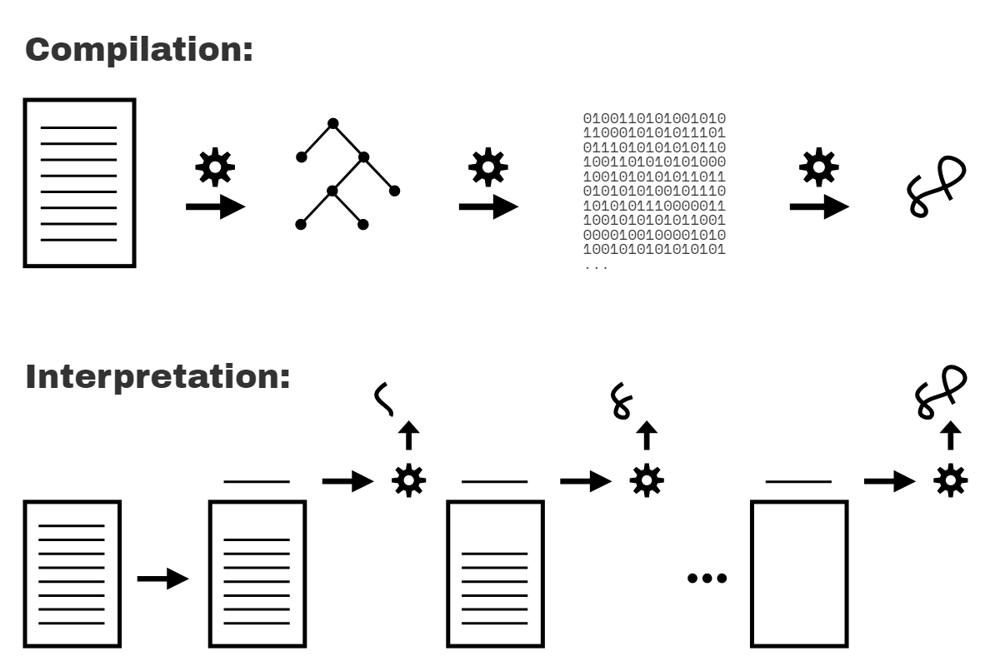

# What's the Scope?

## Compiled vs. Interpreted

**Code compilation is a set of steps that process the text of your code and turn it into a list of instructions the computer can understand.** Typically, the whole source code is transformed at once, and those resulting instructions are saved as output (usually in a file) that can later be executed.

You also may have heard that code can be _interpreted_, so how is that different from being _compiled_?

Interpretation performs a similar task to compilation, in that it transforms your program into machine-understandable instructions. But the processing model is different. Unlike a program being compiled all at once, **with interpretation the source code is transformed line by line; each line or statement is executed before immediately proceeding to processing the next line of the source code.**

<br>
<figure>
<div align="center">

</div>
<div align="center">
<figcaption><em>Compiled vs. Interpreted Code</em></figcaption>
</div>
</figure>
<br>

The figure above illustrates the compilation and interpretation of the program.

Are these two processing models mutually exclusive? Generally, yes. However, the issue is more nuanced, because interpretation can actually take other forms than just operating line by line on source code text. **Modern JS engines actually employ numerous variations of both compilation and interpretation** in the handling of JS programs.

## Compiling Code

But first, why does it even matter whether JS is compiled or not?

Scope is primarily determined during compilation, so understanding how compilation and execution relate is key in mastering scope.

In classic compiler theory, a program is processed by a compiler in three basic stages:

1. **Tokenizing/Lexing:** breaking up a string of characters into meaningful (to the language) chunks, called tokens. For instance, consider the program: `var a = 2;`. This program would likely be broken up into the following tokens: `var`, `a`, `=`, `2`, and `;`. Whitespace may or may not be persisted as a token, depending on whether it's meaningful or not.

   (The difference between tokenizing and lexing is subtle and academic, but it centers on whether or not these tokens are identified in a _stateless_ or _stateful_ way. Put simply, if the tokenizer were to invoke stateful parsing rules to figure out whether `a` should be considered a distinct token or just part of another token, _that_ would be **lexing**.)

2. **Parsing:** taking a stream (array) of tokens and turning it into a tree of nested elements, which collectively represent the grammatical structure of the program. This is called an **Abstract Syntax Tree (AST).**

   For example, the tree for `var a = 2;` might start with a top-level node called `VariableDeclaration`, with a child node called `Identifier` (whose value is `a`), and another child called `AssignmentExpression` which itself has a child called `NumericLiteral` (whose value is `2`).

3. **Code Generation:** taking an AST and turning it into executable code. This part varies greatly depending on the language, the platform it's targeting, and other factors.

   The JS engine takes the just described AST for `var a = 2;` and turns it into a set of machine instructions to actually _create_ a variable called `a` (including reserving memory, etc.), and then store a value into `a`.

| NOTE:                                                                                                                                                                                                                                                              |
| :----------------------------------------------------------------------------------------------------------------------------------------------------------------------------------------------------------------------------------------------------------------- |
| **The implementation details of a JS engine (utilizing system memory resources, etc.) is much deeper than we will dig here. We'll keep our focus on the observable behavior of our programs and let the JS engine manage those deeper system-level abstractions.** |

The JS engine is vastly more complex than _just_ these three stages. In the process of parsing and code generation, there are steps to optimize the performance of the execution (i.e., collapsing redundant elements). In fact, code can even be re-compiled and re-optimized during the progression of execution.

So, I'm painting only with broad strokes here. But you'll see shortly why _these_ details we _do_ cover, even at a high level, are relevant.

JS engines don't have the luxury of an abundance of time to perform their work and optimizations, because JS compilation doesn't happen in a build step ahead of time, as with other languages. It usually must happen in mere microseconds (or less!) right before the code is executed. To ensure the fastest performance under these constraints, JS engines use all kinds of tricks (like JITs, which lazy compile and even hot re-compile); these are well beyond the "scope" of our discussion here.

### Required: Two Phases

To state it as simply as possible, the most important observation we can make about processing of JS programs is that it occurs in (at least) two phases: **parsing/compilation first, then execution.**

The separation of a parsing/compilation phase from the subsequent execution phase is observable fact, not theory or opinion. While the JS specification does not require "compilation" explicitly, it requires behavior that is essentially only practical with a compile-then-execute approach.

There are three program characteristics you can observe to prove this to yourself: **syntax errors, early errors, and hoisting.**

#### Syntax Errors from the Start

Consider this program:

```js
var greeting = "Hello";

console.log(greeting);

greeting = ."Hi";
// SyntaxError: unexpected token .
```

This program produces no output (`"Hello"` is not printed), but instead throws a `SyntaxError` about the unexpected `.` token right before the `"Hi"` string. Since the syntax error happens after the well-formed `console.log(..)` statement, if JS was executing top-down line by line, one would expect the `"Hello"` message being printed before the syntax error being thrown. That doesn't happen.

**In fact, the only way the JS engine could know about the syntax error on the third line, before executing the first and second lines, is by the JS engine first parsing the entire program before any of it is executed.**

#### Early Errors

Next, consider:

```js
console.log("Howdy");

saySomething("Hello", "Hi");
// Uncaught SyntaxError: Duplicate parameter name not
// allowed in this context

function saySomething(greeting, greeting) {
	"use strict";
	console.log(greeting);
}
```

The `"Howdy"` message is not printed, despite being a well-formed statement.

Instead, just like the snippet in the previous section, the `SyntaxError` here is thrown before the program is executed. In this case, it's because strict-mode (opted in for only the `saySomething(..)` function here) forbids, among many other things, functions to have duplicate parameter names; this has always been allowed in non-strict-mode.

The error thrown is not a syntax error in the sense of being a malformed string of tokens (like `."Hi"` prior), but in strict-mode is nonetheless required by the specification to be thrown as an "early error" before any execution begins.

**But how does the JS engine know that the `greeting` parameter has been duplicated? How does it know that the `saySomething(..)` function is even in strict-mode while processing the parameter list (the `"use strict"` pragma appears only later, in the function body)?**

**Again, the only reasonable explanation is that the code must first be _fully_ parsed before any execution occurs.**

#### Hoisting

Finally, consider:

```js
function saySomething() {
	var greeting = "Hello";
	{
		greeting = "Howdy"; // error comes from here
		let greeting = "Hi";
		console.log(greeting);
	}
}

saySomething();
// ReferenceError: Cannot access 'greeting' before
// initialization
```

The noted `ReferenceError` occurs from the line with the statement `greeting = "Howdy"`. What's happening is that the `greeting` variable for that statement belongs to the declaration on the next line, `let greeting = "Hi"`, rather than to the previous `var greeting = "Hello"` statement.

The only way the JS engine could know, at the line where the error is thrown, that the _next statement_ would declare a block-scoped variable of the same name (`greeting`) is if the JS engine had already processed this code in an earlier pass, and already set up all the scopes and their variable associations. This processing of scopes and declarations can only accurately be accomplished by parsing the program before execution.

The `ReferenceError` here technically comes from `greeting = "Howdy"` accessing the `greeting` variable **too early**, a conflict referred to as the Temporal Dead Zone (TDZ). Chapter 5 will cover this in more detail.

| WARNING:                                                                                                                                                                                                                                        |
| :---------------------------------------------------------------------------------------------------------------------------------------------------------------------------------------------------------------------------------------------- |
| It's often asserted that `let` and `const` declarations are not hoisted, as an explanation of the TDZ behavior just illustrated. But this is not accurate. We'll come back and explain both the hoisting and TDZ of `let`/`const` in Chapter 5. |

Hopefully you're now convinced that JS programs are parsed before any execution begins. But does it prove they are compiled?

This is an interesting question to ponder. Could JS parse a program, but then execute that program by _interpreting_ operations represented in the AST **without** first compiling the program? Yes, that is _possible_. But it's extremely unlikely, mostly because it would be extremely inefficient performance wise.

It's hard to imagine a production-quality JS engine going to all the trouble of parsing a program into an AST, but not then converting (aka, "compiling") that AST into the most efficient (binary) representation for the engine to then execute.

Many have endeavored to split hairs with this terminology, as there's plenty of nuance and "well, actually..." interjections floating around. But in spirit and in practice, what the engine is doing in processing JS programs is **much more alike compilation** than not.

Classifying JS as a compiled language is not concerned with the distribution model for its binary (or byte-code) executable representations, but rather in keeping a clear distinction in our minds about the phase where JS code is processed and analyzed; this phase observably and indisputedly happens _before_ the code starts to be executed.

We need proper mental models of how the JS engine treats our code if we want to understand JS and scope effectively.
